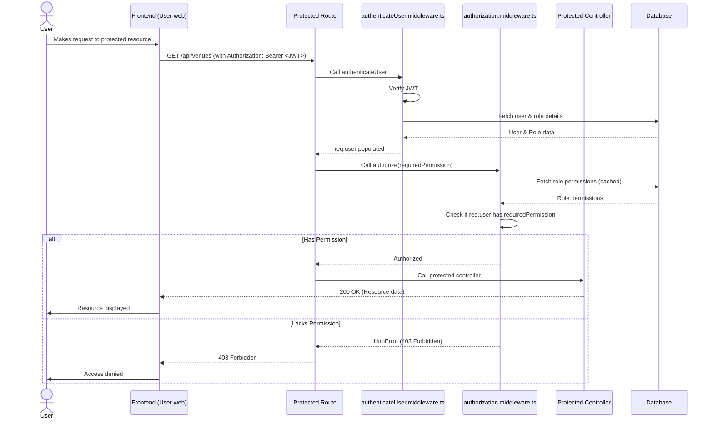

# Authentication and Authorization Module Design

This document details the design and implementation of the Authentication and Authorization module within the `http-backend` application of the BookMySportz platform. It outlines the responsibilities of services, controllers, routes, and middleware, adhering to strong Low-Level Design (LLD) principles and industry best practices.


## 1. Architecture Overview

The Authentication and Authorization module follows a layered architecture, separating concerns into distinct components: Routes, Controllers, Middleware, and Services. This structure promotes modularity, testability, and maintainability.

```mermaid
graph TD
    subgraph Client
        A[Client Applications]
    end

    subgraph Backend [http-backend]
        B[Auth Routes]
        C[Auth Middleware]
        D[Authz Middleware]
        E[Auth Controllers]
        F[Auth Service]
        G[Token Service]
        H[Email Service]
        I[Database]
        J[Common Schema]

        B --> C
        C --> D
        D --> E
        E --> F
        F --> G
        F --> H
        F --> I
        E --> J
        G --> I
    end

    A -- Requests --> B

## 2. Key Components and Responsibilities

### a. Routes (`apps/http-backend/src/routes/auth-routes/`)

*   **Purpose:** Define the API endpoints for authentication and authorization-related operations.
*   **Structure:** Routes are organized by user type (e.g., `user/auth.routes.ts`, `platform-admin/auth.routes.ts`, `venue-admin/auth.routes.ts`).
*   **Responsibilities:**
    *   Map HTTP methods (GET, POST, etc.) to specific URL paths.
    *   Apply middleware (authentication, authorization, validation) before handing control to controllers.
    *   Import and use controllers for handling the request logic.

### b. Controllers (`apps/http-backend/src/controllers/auth-controller/`)

*   **Purpose:** Act as the entry point for incoming requests, orchestrating the flow between the request, services, and response.
*   **Structure:** Controllers are also organized by user type (e.g., `user/login.controller.ts`, `platform-admin/login.controller.ts`).
*   **Responsibilities:**
    *   Receive validated request data from middleware.
    *   Call appropriate methods on authentication services to perform business logic.
    *   Handle service responses and errors.
    *   Construct and send HTTP responses back to the client.
    *   **Adherence to LLD:** Controllers are kept thin, focusing on request/response handling and delegating complex logic to services (SRP).

### c. Services (`apps/http-backend/src/services/auth-service/`)

*   **Purpose:** Encapsulate the core business logic for all authentication and authorization operations.
*   **Structure:** Services are highly modular, with dedicated files for specific functionalities (e.g., `user/login-email-password.service.ts`, `user/register-with-email.service.ts`, `user/password-reset.service.ts`, `user/google-account-linking.service.ts`, `verification-service/email-verification.service.ts`).
*   **Responsibilities:**
    *   Interact with the database (via Prisma) to fetch and store user data, roles, and tokens.
    *   Perform password hashing and verification (using `bcryptjs`).
    *   Generate and validate JWTs (using `jsonwebtoken`).
    *   Coordinate with other services like `TokenService` and `EmailService`.
    *   Implement complex authentication flows (e.g., MFA, account linking).
    *   **Adherence to LLD:** Services are designed to be independent and reusable. They abstract away database interactions and external service calls, promoting the Dependency Inversion Principle (DIP).

### d. Middleware (`apps/http-backend/src/middleware/`)

*   **Purpose:** Handle cross-cutting concerns such as authentication, authorization, and input validation before requests reach the controllers.
*   **Key Middleware:**
    *   **`authenticateUser.middleware.ts`**: Responsible for verifying the JWT provided in the `Authorization` header. If valid, it decodes the token and populates `req.user` with authenticated user details (ID, email, role, etc.). If no token or an invalid token is present, it sets the actor context to `ANONYMOUS` for logging purposes and proceeds, allowing public routes to be accessed.
    *   **`authorization.middleware.ts`**: Implements the RBAC logic. It checks if the authenticated user (`req.user` must be populated by `authenticateUser`) has the necessary permissions to access a specific route or perform an action. It leverages an in-memory cache for role permissions to optimize performance. It also handles specific permission types like `_own` (for resource ownership checks) and `_by_region` (for regional access).
    *   **`validate.ts`**: (Implicitly used) Middleware for validating incoming request payloads against Zod schemas defined in `@workspace/common/src/schema/auth/index.ts`.
*   **Adherence to LLD:** Middleware functions are single-responsibility units (SRP) that can be chained together, promoting a modular and extensible request processing pipeline.

### e. Token Service (`apps/http-backend/src/services/token-service/`)

*   **Purpose:** Centralized management of various types of tokens used in the system.
*   **Structure:** Organized by token type (e.g., `user/access-token.service.ts`, `user/refresh-token.service.ts`, `user/password-reset-token.service.ts`, `user/verification-token.service.ts`).
*   **Responsibilities:**
    *   Generate JWTs (access and refresh tokens).
    *   Create and manage database entries for other token types (e.g., email verification, password reset, invitation tokens).
    *   Validate and invalidate tokens.

### f. Email Service (`apps/http-backend/src/services/email-service/`)

*   **Purpose:** Handles sending various types of emails related to authentication and user management.
*   **Structure:** Includes `base-email.service.ts` for common email sending logic and specific services like `otp-email-sender.service.ts` and `password-reset-email-sender.service.ts`.
*   **Responsibilities:**
    *   Compose email content using templates.
    *   Integrate with an external email provider (e.g., Nodemailer).

### g. Common Schema (`packages/common/src/schema/auth/index.ts`)

*   **Purpose:** Provides Zod schemas for validating incoming request data related to authentication (e.g., login credentials, registration data, password reset requests).
*   **Benefits:** Ensures data integrity and consistency, and provides clear validation rules.

## 3. Authentication Flow (User Login Example)

This diagram illustrates the typical flow for a user logging in with email and password.

```mermaid
sequenceDiagram
    actor User
    participant Client as Frontend (User-web)
    participant Routes as Auth Routes
    participant Validate as Validation Middleware
    participant Controller as Auth Controller
    participant AuthService as Auth Service
    participant TokenService as Token Service
    participant DB as Database

    User->>Client: Enters email & password
    Client->>Routes: POST /api/auth/login (email, password)
    Routes->>Validate: Apply Zod schema validation
    Validate-->>Routes: Validated data
    Routes->>Controller: Call login controller
    Controller->>AuthService: Call login service (email, password)
    AuthService->>DB: Find user by email
    DB-->>AuthService: User data
    AuthService->>AuthService: Verify password (bcrypt)
    alt Password Valid
        AuthService->>TokenService: Generate Access Token (JWT)
        TokenService-->>AuthService: Access Token
        AuthService->>TokenService: Generate Refresh Token
        TokenService->>DB: Store Refresh Token
        DB-->>TokenService: Stored
        TokenService-->>AuthService: Refresh Token
        AuthService-->>Controller: Access & Refresh Tokens
        Controller-->>Client: 200 OK (Tokens)
        Client->>User: Login successful
    else Password Invalid
        AuthService-->>Controller: AuthenticationError
        Controller-->>Client: 401 Unauthorized
        Client->>User: Login failed
    end
```

## 4. Authorization Flow

This diagram illustrates how authorization is enforced for a protected API endpoint.



## 5. Design Principles Applied

*   **Separation of Concerns (SoC):** Clear distinction between routing, control, business logic, and data access layers.
*   **Single Responsibility Principle (SRP):** Each module/class/function has a single, well-defined responsibility.
*   **Dependency Inversion Principle (DIP):** High-level modules (controllers) depend on abstractions (services) rather than concrete implementations, facilitating testability and flexibility.
*   **Don't Repeat Yourself (DRY):** Common logic (e.g., token generation, email sending, validation schemas) is centralized in dedicated services and common packages.
*   **Modularity and Reusability:** Components are designed to be independent and reusable across different parts of the application (e.g., `TokenService` can be used by various authentication flows).
*   **Robust Error Handling:** Integrated custom error classes and centralized error middleware for consistent and informative error responses.
*   **Security by Design:** Emphasis on secure password handling, JWT best practices, and granular RBAC.

This design ensures a secure, scalable, and maintainable authentication and authorization system for BookMySportz.
